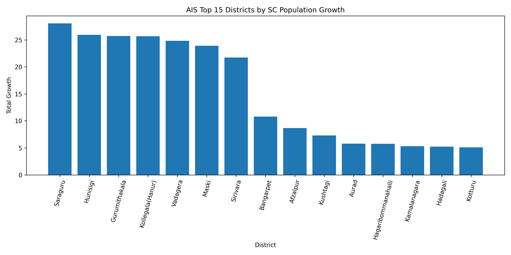

# Smart Regional Inclusion Analysis System

## Project Overview

The **Smart Regional Inclusion Analysis System** is a machine learning and optimization-based analytics project built to study **district-wise Scheduled Caste (SC) population percentage** across **rural, urban, and total population segments**.

The project uses demographic data from **2001 and 2011** to:

- analyze Scheduled Caste population trends,
- identify district-level growth patterns,
- compare rural and urban SC concentration,
- predict the **2011 total SC population percentage**,
- and evaluate optimization-driven ML models using **AIS, CSA, and PSO**.

This system is designed as a **regional inclusion and demographic intelligence platform** that can support **policy planning, welfare targeting, and social equity analysis**.

---

# Project Title

## **Smart Scheduled Caste Population Growth and Regional Inclusion Analysis System**

---

# Author

**Sagnik Patra**

---

# Dataset Information

This project uses the following dataset:

```text
Percentage_of_Scheduled_Caste_Population_to_Total_Population.csv

The dataset contains district-level Scheduled Caste population percentages for:

Rural population
Urban population
Total population

for the years 2001 and 2011.

Dataset Columns
Column Name	Description
District	Name of the district
Percentage of Scheduled Caste Population _2001_Rural	SC population percentage in rural areas in 2001
Percentage of Scheduled Caste Population _2001_Urban	SC population percentage in urban areas in 2001
Percentage of Scheduled Caste Population _2001_Total	Total SC population percentage in 2001
Percentage of Scheduled Caste Population _2011_Rural	SC population percentage in rural areas in 2011
Percentage of Scheduled Caste Population _2011_Urban	SC population percentage in urban areas in 2011
Percentage of Scheduled Caste Population _2011_Total	Total SC population percentage in 2011
Problem Statement

Understanding the regional distribution of Scheduled Caste population is important for social welfare planning, inclusion policies, education support, healthcare access, and district-level resource allocation.

Manual analysis of demographic data often fails to capture:

district-level growth patterns,
rural vs urban disparity,
high-priority inclusion districts,
and future population trend indicators.

This project solves that problem by building a smart analytics and prediction system that can automatically analyze Scheduled Caste population data and generate meaningful district-level insights.

Objectives

The major objectives of this project are:

To analyze district-wise Scheduled Caste population percentage
To compare SC population trends in rural, urban, and total categories
To measure growth in Scheduled Caste population between 2001 and 2011
To identify high-growth and high-priority districts
To engineer demographic features that improve prediction
To predict 2011 total Scheduled Caste population percentage
To evaluate machine learning and deep learning performance
To improve prediction using bio-inspired optimization algorithms
To generate result files, model files, and visualization graphs
Proposed System

The proposed system performs the following tasks:

Loads and cleans the district-wise Scheduled Caste population dataset
Creates engineered features such as growth and rural-urban gap
Encodes district names into numerical form
Splits the data into training and testing sets
Scales features for model training
Uses optimization algorithms to learn best feature weights
Trains Random Forest and Deep Learning models
Evaluates performance using regression metrics
Saves all results, predictions, and trained models
Generates multiple graphs for result interpretation
Core Algorithms Used
1. Random Forest Regressor

Random Forest Regressor is used to predict the 2011 total Scheduled Caste population percentage using engineered district-level features.

Why Random Forest?
Handles non-linear relationships well
Works effectively on structured tabular data
Robust against noise and overfitting
Good baseline for optimization-based regression
2. Deep Learning Model

A feedforward neural network is used to learn complex relationships between demographic features and the target output.

Architecture used
Dense layer with 64 neurons
Dropout layer
Dense layer with 32 neurons
Dense layer with 16 neurons
Final output layer with 1 neuron
Why Deep Learning?
Captures deeper non-linear feature interactions
Useful for testing performance beyond classical ML models
Can be combined with optimization-based feature weighting
Optimization Algorithms Used
3. AIS – Artificial Immune System

AIS is inspired by the biological immune system. In this project, AIS is used to search for optimal feature weights that improve the prediction performance of Random Forest.

AIS workflow
Initialize a population of candidate feature-weight vectors
Evaluate each vector using Random Forest R² score
Select the best candidates
Clone and mutate them
Replace weak candidates with improved ones
Repeat for multiple iterations
AIS output
Best feature weight vector
Best R² score found
Convergence history across iterations
4. CSA – Clonal Selection Algorithm

CSA is an immune-inspired optimization method that uses cloning and mutation of high-performing solutions.

CSA workflow
Generate initial population
Evaluate all candidate solutions
Select high-affinity candidates
Clone them
Apply adaptive mutation
Keep best candidates for the next generation
CSA output
Optimized feature weights
Best model score
Convergence graph
5. PSO – Particle Swarm Optimization

PSO is a swarm intelligence algorithm where particles move through the search space to find the best solution.

PSO workflow
Initialize particles with random feature weights
Track personal best and global best positions
Update particle velocity and position
Evaluate model score after each update
Continue until convergence
PSO output
Best feature weights
Best R² score
Convergence graph
Feature Engineering

To improve model performance and capture demographic relationships, the following new features are created.

Engineered Features
Feature Name	Description
Rural_Growth	Rural SC percentage growth from 2001 to 2011
Urban_Growth	Urban SC percentage growth from 2001 to 2011
Total_Growth	Total SC percentage growth from 2001 to 2011
Rural_Urban_Gap_2001	Difference between rural and urban SC percentage in 2001
Rural_Urban_Gap_2011	Difference between rural and urban SC percentage in 2011
Average_SC_Percentage	Mean of all rural, urban, and total SC percentages
Priority_Score	Weighted demographic priority score for inclusion analysis
Priority Score Formula

A regional priority score is calculated to estimate district-level inclusion importance.

Priority_Score = (
    Total_2011 * 0.6 +
    Total_Growth * 0.3 +
    abs(Rural_Urban_Gap_2011) * 0.1
)

This score helps categorize districts into:

Low Priority
Medium Priority
High Priority
Target Variable

The project predicts the following target:

Percentage of Scheduled Caste Population _2011_Total

This means the goal is to estimate the 2011 total Scheduled Caste population percentage using historical and engineered district-level features.

Input Features Used for Modeling

The following columns are used as model features:

District_Encoded
Percentage of Scheduled Caste Population _2001_Rural
Percentage of Scheduled Caste Population _2001_Urban
Percentage of Scheduled Caste Population _2001_Total
Percentage of Scheduled Caste Population _2011_Rural
Percentage of Scheduled Caste Population _2011_Urban
Rural_Growth
Urban_Growth
Total_Growth
Rural_Urban_Gap_2001
Rural_Urban_Gap_2011
Average_SC_Percentage
Priority_Score
Project Workflow
Dataset Loading
      ↓
Data Cleaning
      ↓
Feature Engineering
      ↓
District Encoding
      ↓
Train-Test Split
      ↓
Feature Scaling
      ↓
Optimization Algorithm (AIS / CSA / PSO)
      ↓
Random Forest + Deep Learning Training
      ↓
Prediction
      ↓
Evaluation
      ↓
CSV / H5 / PKL / JSON / YAML Saving
      ↓
Graph Visualization
Visual Output

The project uses ais_growth_graph.png as a key visualization.

Growth Visualization

This graph highlights the top districts by Scheduled Caste population growth.


Embedded Visualization

This graph helps identify which districts have shown the strongest increase in Scheduled Caste population percentage over the study period.

Model Evaluation Metrics

The project evaluates model performance using the following regression metrics.

Metric	Description
MAE	Mean Absolute Error
MSE	Mean Squared Error
RMSE	Root Mean Squared Error
R2 Score	Measures goodness of fit
Accuracy Percentage	R2 score converted into percentage
Output Files Generated

The project saves complete outputs for AIS, CSA, and PSO runs separately.

AIS Output Files
File Name	Description
ais_model.h5	Deep learning model in H5 format
ais_model.pkl	Random Forest model, scaler, encoder, and AIS feature weights
ais_results.json	AIS metrics, feature weights, convergence history
ais_config.yaml	AIS project configuration
ais_result.csv	AIS model evaluation metrics
ais_prediction.csv	AIS prediction results for test data
ais_full_dataset_result.csv	Full dataset with AIS predictions and errors
ais_accuracy_graph.png	Accuracy graph for AIS models
ais_heatmap.png	Feature correlation heatmap
ais_comparison_graph.png	MAE vs RMSE comparison graph
ais_result_graph.png	R2 score graph
ais_prediction_graph.png	Actual vs predicted graph
ais_convergence_graph.png	AIS optimization convergence graph
ais_growth_graph.png	District growth graph
ais_training_graph.png	Deep learning training loss graph
CSA Output Files
File Name	Description
csa_model.h5	Deep learning model in H5 format
csa_model.pkl	Random Forest model, scaler, encoder, and CSA feature weights
csa_results.json	CSA metrics, feature weights, convergence history
csa_config.yaml	CSA project configuration
csa_result.csv	CSA model evaluation metrics
csa_prediction.csv	CSA prediction results for test data
csa_full_dataset_result.csv	Full dataset with CSA predictions and errors
csa_accuracy_graph.png	Accuracy graph for CSA models
csa_heatmap.png	Feature correlation heatmap
csa_comparison_graph.png	MAE vs RMSE comparison graph
csa_result_graph.png	R2 score graph
csa_prediction_graph.png	Actual vs predicted graph
csa_convergence_graph.png	CSA optimization convergence graph
csa_growth_graph.png	District growth graph
csa_training_graph.png	Deep learning training loss graph
PSO Output Files
File Name	Description
pso_model.h5	Deep learning model in H5 format
pso_model.pkl	Random Forest model, scaler, encoder, and PSO feature weights
pso_results.json	PSO metrics, feature weights, convergence history
pso_config.yaml	PSO project configuration
pso_result.csv	PSO model evaluation metrics
pso_prediction.csv	PSO prediction results for test data
pso_full_dataset_result.csv	Full dataset with PSO predictions and errors
pso_accuracy_graph.png	Accuracy graph for PSO models
pso_heatmap.png	Feature correlation heatmap
pso_comparison_graph.png	MAE vs RMSE comparison graph
pso_result_graph.png	R2 score graph
pso_prediction_graph.png	Actual vs predicted graph
pso_convergence_graph.png	PSO optimization convergence graph
pso_growth_graph.png	District growth graph
pso_training_graph.png	Deep learning training loss graph
Folder Structure
Regional Inclusion Analysis System/
│
├── Percentage_of_Scheduled_Caste_Population_to_Total_Population.csv
│
├── ais_model.h5
├── ais_model.pkl
├── ais_results.json
├── ais_config.yaml
├── ais_result.csv
├── ais_prediction.csv
├── ais_full_dataset_result.csv
├── ais_accuracy_graph.png
├── ais_heatmap.png
├── ais_comparison_graph.png
├── ais_result_graph.png
├── ais_prediction_graph.png
├── ais_convergence_graph.png
├── ais_growth_graph.png
├── ais_training_graph.png
│
├── csa_model.h5
├── csa_model.pkl
├── csa_results.json
├── csa_config.yaml
├── csa_result.csv
├── csa_prediction.csv
├── csa_full_dataset_result.csv
├── csa_accuracy_graph.png
├── csa_heatmap.png
├── csa_comparison_graph.png
├── csa_result_graph.png
├── csa_prediction_graph.png
├── csa_convergence_graph.png
├── csa_growth_graph.png
├── csa_training_graph.png
│
├── pso_model.h5
├── pso_model.pkl
├── pso_results.json
├── pso_config.yaml
├── pso_result.csv
├── pso_prediction.csv
├── pso_full_dataset_result.csv
├── pso_accuracy_graph.png
├── pso_heatmap.png
├── pso_comparison_graph.png
├── pso_result_graph.png
├── pso_prediction_graph.png
├── pso_convergence_graph.png
├── pso_growth_graph.png
├── pso_training_graph.png
Technologies Used
Python
Pandas
NumPy
Matplotlib
Scikit-learn
TensorFlow / Keras
Pickle
JSON
YAML
Installation

Install all required libraries using:

pip install pandas numpy matplotlib scikit-learn tensorflow pyyaml
How to Run the Project
Step 1: Set dataset path
csv_path = r"C:\Users\NXTWAVE\Downloads\Regional Inclusion Analysis System\Percentage_of_Scheduled_Caste_Population_to_Total_Population.csv"
Step 2: Set output directory
output_dir = r"C:\Users\NXTWAVE\Downloads\Regional Inclusion Analysis System"
Step 3: Run the algorithm-specific file
For AIS
python ais_regional_inclusion.py
For CSA
python csa_regional_inclusion.py
For PSO
python pso_regional_inclusion.py
Example Result CSV Structure
ais_result.csv
Model	MAE	MSE	RMSE	R2_Score	Accuracy_Percentage
AIS Random Forest	value	value	value	value	value
AIS Deep Learning	value	value	value	value	value
Example Prediction CSV Structure
ais_prediction.csv
District	Actual_2011_Total_SC_Percentage	AIS_RF_Prediction	AIS_DL_Prediction
District A	15.18	15.02	15.26
District B	18.44	18.10	18.52
Interpretation of Graphs
1. Accuracy Graph

Shows the accuracy percentage of optimized Random Forest and Deep Learning models.

2. Heatmap

Displays correlation among original and engineered demographic features.

3. Comparison Graph

Compares MAE and RMSE of different models.

4. Result Graph

Shows R² score of the models.

5. Prediction Graph

Compares actual vs predicted 2011 total SC percentage.

6. Convergence Graph

Shows how the optimization algorithm improves its best score over iterations.

7. Growth Graph

Displays districts with the highest Scheduled Caste population growth.

8. Training Graph

Shows deep learning training loss and validation loss.

Applications of the Project

This project can be useful in:

District-level social welfare planning
Scheduled Caste demographic analysis
Rural vs urban inclusion comparison
Educational and scholarship targeting
Healthcare and social infrastructure planning
Population growth trend monitoring
Government resource allocation
Academic research in demographic analytics
Policy support for social inclusion programs
Advantages of the System
Uses both classical ML and deep learning
Includes bio-inspired optimization algorithms
Generates a large number of result artifacts automatically
Supports district-level demographic interpretation
Produces ready-to-use graphs and CSV reports
Can be extended to other population or social datasets
Future Enhancements

Possible future improvements for this project include:

Adding district-wise GIS mapping
Predicting future SC percentage for 2021 or later
Building a Streamlit or Flask dashboard
Adding more socio-economic features such as literacy, income, and education
Comparing multiple states instead of one regional dataset
Building a district ranking dashboard with live filtering
Conclusion

The Smart Regional Inclusion Analysis System is a demographic intelligence and prediction framework that studies Scheduled Caste population trends across districts using machine learning, deep learning, and bio-inspired optimization algorithms.

By combining feature engineering, priority scoring, Random Forest regression, Deep Learning, AIS, CSA, and PSO, the system provides a strong foundation for:

regional inclusion analysis,
district-level demographic prediction,
growth trend discovery,
and data-driven social planning.

The project is suitable for:

final-year ML projects
government analytics case studies
social inclusion research
district demographic intelligence systems
portfolio-ready optimization-based data science projects
